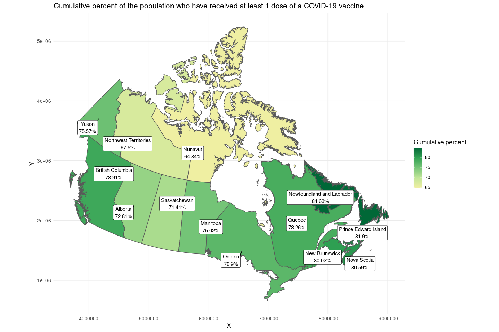

<!-- README.md is generated from README.Rmd. Please edit that file -->

# canadamaps

## TODOs

Run script 01 in data\_processing, then

-   [x] determine if the economic zones map can be obtained as “sums” of
    the census zones map
-   [x] determine if the federal\_electoral districts map can be
    obtained as “sums” of the census zones map

economic zones ok

federal districts is a separate map

## the idea

the idea is to avoid “duplications”, for example instead of adding a
provinces map, we do:

``` r
library(ggplot2)
library(canadamaps)
#> Loading required package: sf
#> Linking to GEOS 3.8.0, GDAL 3.0.4, PROJ 6.3.1
#> Registered S3 method overwritten by 'geojsonlint':
#>   method         from 
#>   print.location dplyr

provinces <- get_provinces()

ggplot(data = provinces) + geom_sf(aes(geometry = geometry))
```


let’s see what creates the provinces map:

``` r
ggplot(data = census_divisions) + geom_sf(aes(geometry = geometry))
```


